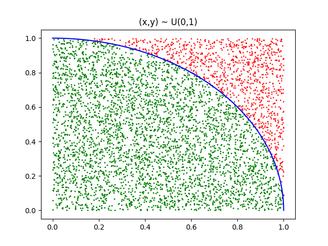
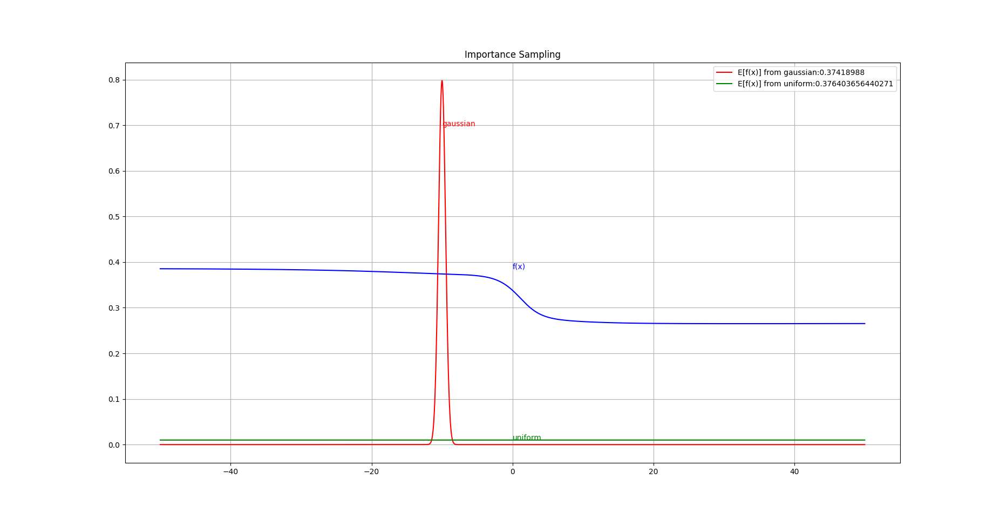

# Common-Sampling-Methods
## List
- Monte Carlo Methods
- Importance Sampling
- Gibbs Sampling

## Contents
### Monte Carlo Methods
e.g., The estimation of the  :
(x, y) ~ U(0, 1), p(x*x + y*y < 1) = \pi / 4.0



```
python3 monte_carlo.py
```

### Importance Sampling



```
python3 importance.py
```

